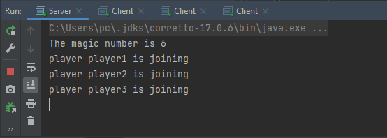
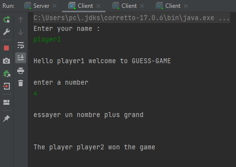
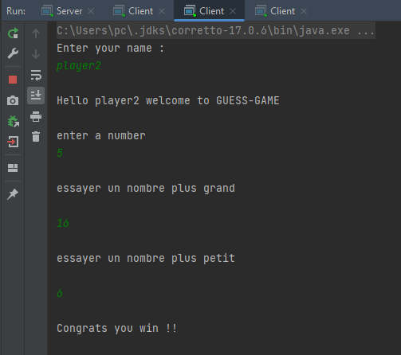
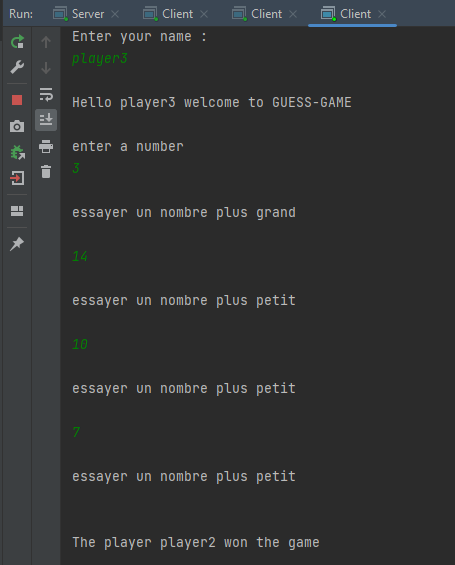

<h2>Création un serveur JEU GRPC :</h2>
<h4>- Au démarrage le serveur choisit un nombre</h4>
<h4>- Ensuite les clients GRPC doivent deviner en compétition le nombre secret.</h4>
<h4>- le serveur répond à chaque fois avec les éventualités suivantes :</h4>

<ul>
<li>Votre nombre est plus grand</li>
<li>Votre nombre est plus petit</li>
<li>Congrats you win et envoyer le gagnant aux clients</li>
</ul>

<h3>Serveur<h3>

<h3>Player 1<h3>

<h3>Player 2<h3>

<h3>Player 3<h3>
